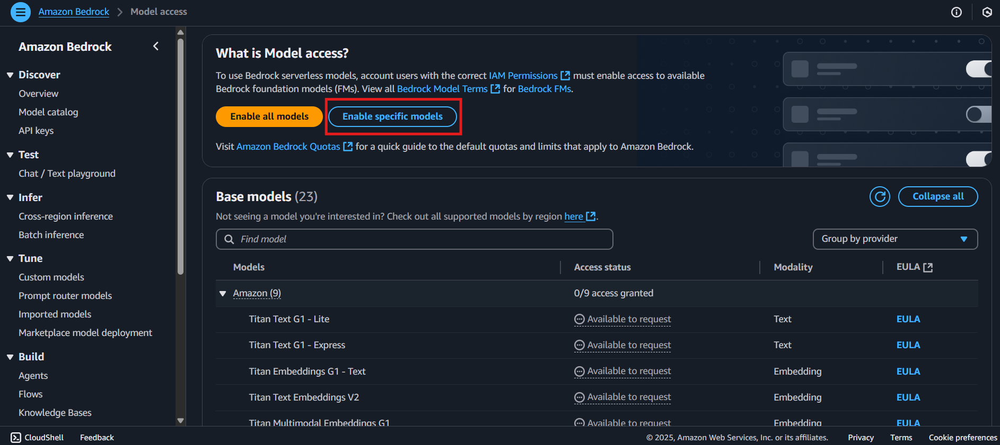
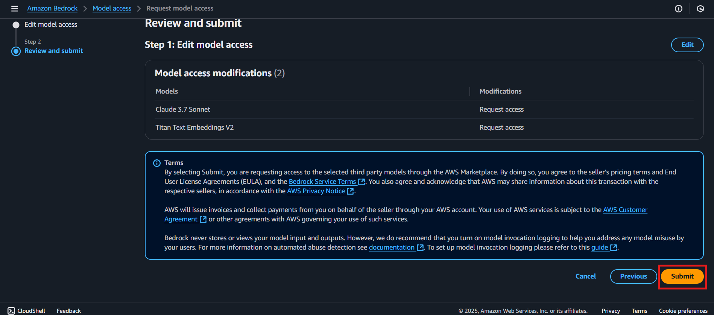
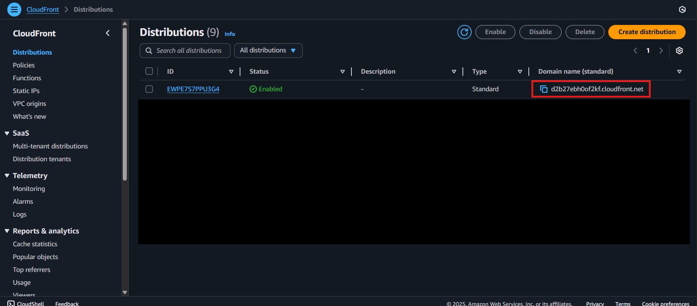

# GenAI Foundry CDK Deployment Guide
## Overview
**GenAI Foundry** is an AI-powered sandbox platform for banking and insurance. Powered by Generative AI with RAG-enabled conversational capabilities, it delivers intelligent virtual assistants, voice-enabled chatbots, automated document processing, and advanced risk assessment. It enables post-call analysis, underwriting decision support, and multi-channel customer engagement—driving faster decisions, greater efficiency, and exceptional customer experiences.
> **Disclaimer**: This CDK setup is strictly designed and tested for the `us-west-2` region (Oregon). Please ensure that all resources are deployed only within this region to avoid compatibility issues.
---
## Prerequisites
Before beginning the deployment process:
* Ensure you have access to the correct AWS account.
* You must be using the **`us-west-2`** AWS region.
---
## Pre Deployment Steps
### Login to the AWS Console
Log in to the provided AWS account using the IAM credentials or SSO as per the shared instructions.
### Request Model Access in Bedrock
Navigate to the **Amazon Bedrock** service in the AWS Console.
* Open the **Model access** tab.
* Request access to the following models:
  ```
  - Claude 3.7 Sonnet
  - Amazon Titan Embedding V2
  - Amazon Nova Canvas
  - Amazon Nova Reel
  ```
> It may take a few minutes for the model access to be approved.





---
## Deployment Steps

### 1. Set Region to `us-west-2`
Navigate to the region selector in the AWS Console and ensure that **`US West (Oregon) - us-west-2`** is selected.
> This is critical, as all the CDK resources are scoped and supported only in this region.

---
### 2. Open AWS CloudShell
Launch the AWS CloudShell service from the AWS Console.
> CloudShell provides a pre-configured environment with AWS CLI and CDK support, making it ideal for deployments.

---
### 3. Clone the Repository
```bash
git clone https://github.com/1CloudHub/aivolvex-genai-foundry.git
```

```bash
cd aivolvex-genai-foundry/
```
> Clones the specific branch of the GenAI Foundry CDK repository to your CloudShell environment.
---
### 4. Install python requirements
```bash
pip install --user -r requirements.txt
```
> Installs the AWS CDK Command Line Interface globally in CloudShell.

> ⚠️ **ERROR HANDLING ONLY - DO NOT RUN UNLESS YOU ENCOUNTER SPACE/MEMORY ERRORS:**


If you encounter memory or disk space issues in CloudShell:

- Click the **Actions** menu at the top-right of the CloudShell terminal
- Choose **Delete** to remove the terminal environment
- Open a new CloudShell terminal
- Start again from **Step 1** of this guide

> ⚠️ **Important**: These commands above should ONLY be executed if you encounter an "insufficient space" or memory-related error during installation (common in AWS CloudShell due to limited storage). Do not run these commands as part of the normal installation process.

---
### 5. Install AWS CDK CLI
```bash
sudo npm install -g aws-cdk
```
> Installs the required Python packages for the CDK app to function properly.
---
### 6. Bootstrap CDK
```bash
cdk bootstrap
```
> Prepares your AWS environment for deploying CDK applications by provisioning necessary resources like the CDK toolkit stack.
---
### 7. Deploy the Stack
```bash
cdk deploy GenAiFoundryStack
```


Press 'y' to confirm the deployment.

> Deploys the defined CDK infrastructure into your AWS account. This may take several minutes. Wait until the deployment completes successfully.


---


### 8. Get the Application URL
Navigate to the **CloudFront** service.
* Select the newly created distribution.
* Copy the **Domain Name** listed under **General settings**.
> This is your application's public URL. Note that it may take **5–6 minutes** post-deployment for the CloudFront distribution to become active.


---
## Accessing the Application
Once the CloudFront distribution is active and model access is approved, open the copied domain name in your browser to start using **GenAI Foundry**.
Enjoy the application experience.

>* ⚠️ **Deployment time**: Deployment typically takes 20–30 minutes. After a successful deployment, please wait an additional 10 minutes before using the application.
>* ❗ **EC2 restart note**: If the underlying EC2 instance is stopped and started again, the application will not run automatically and may run into issues.
---
## About GenAI Foundry

GenAIFoundry enables banking and insurance teams to explore AI-powered solutions through an intelligent assistant that understands context, retrieves precise insights, and delivers accurate responses. From post-call analysis to underwriting decision support and multi-channel customer engagement, it transforms complex processes into clear, actionable outcomes—enhancing efficiency, accuracy, and customer satisfaction.

---

## Legal Notice

© 1CloudHub. All rights reserved.

The materials and components herein are provided for demonstration purposes only. No portion of this project may be implemented in a live or production environment without prior technical assessment, security clearance, and explicit approval from 1CloudHub.

---